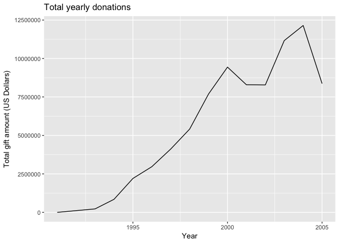
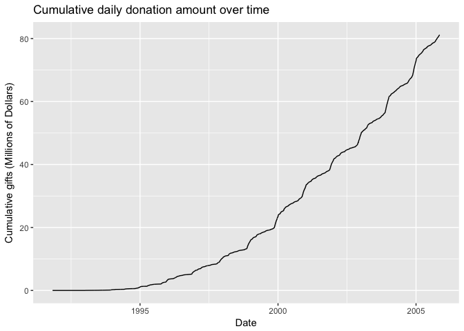
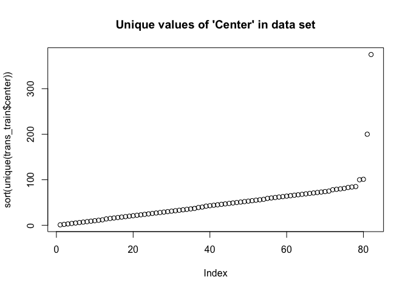
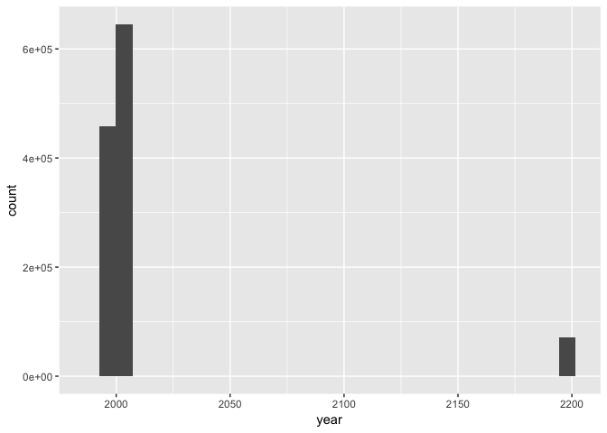
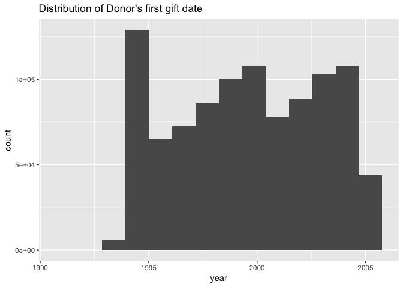
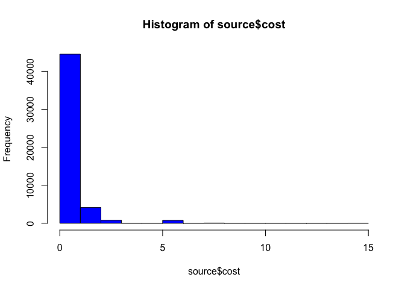
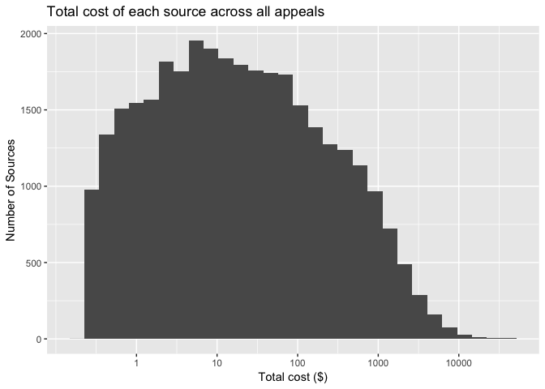
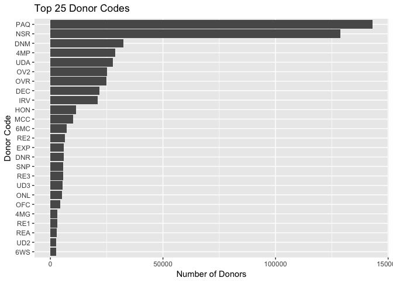
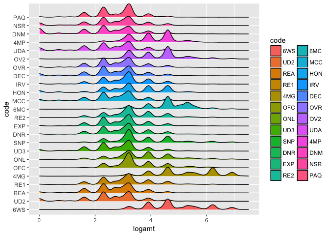
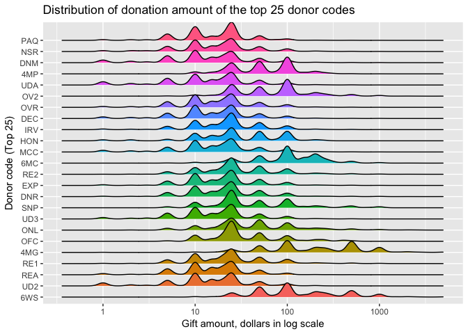

Basic exploration
================
Keith Hultman
September 2, 2017

Explore the data files
======================

``` r
appeal <- readRDS("appeal.RDS")
donor <- readRDS("donor.RDS")
trans_train <- readRDS("trans_train.RDS")
source <- readRDS("source.RDS")
infocode <- readRDS("infocode.RDS")
```

Trans
-----

Let's start exploring the transactions data. Before doing any visualizations on the gift amounts, I first filtered out the final year of transactions in this data set to use as a test set for predictions. Visualizations and modeling will be using the training data set.

``` r
#trans <- readRDS("trans.RDS")
#trans_train <- filter(trans, giftdate < "2005-11-10")
#trans_test <- filter(trans, giftdate >= "2005-11-10")
dim(trans_train)
```

    ## [1] 2670418       6

``` r
head(trans_train)
```

    ## # A tibble: 6 x 6
    ##        id   amt   giftdate     source center   zip
    ##     <chr> <dbl>     <date>      <chr>  <chr> <chr>
    ## 1 2000015    10 1993-11-05 92UULUUUUU    100 18434
    ## 2 2000015    15 1993-11-13 92UULUUUUU    100 18434
    ## 3 2000015    15 1993-11-25 92UULUUUUU    100 18434
    ## 4 2000015    15 1993-12-07 92UULUUUUU    100 18434
    ## 5 2000015    25 1994-12-06 94AAAAAUUU    100 18434
    ## 6 2000015    20 1997-10-01 92NWLAWUUU    100 18434

Let's look at the gift totals over time.

``` r
library(lubridate)
```

    ## 
    ## Attaching package: 'lubridate'

    ## The following object is masked from 'package:base':
    ## 
    ##     date

``` r
yearly_trans <- trans_train %>% mutate(giftyear = year(giftdate)) %>% 
  group_by(giftyear) %>% 
  summarise(gift_per_year = sum(amt))

ggplot(yearly_trans, aes(giftyear, gift_per_year)) + 
  geom_line() + 
  ggtitle("Total yearly donations") +
  labs(x ="Year", y= "Total gift amount (US Dollars)")
```



``` r
trans_train %>% group_by(giftdate) %>% 
  summarise(gift_per_day = sum(amt)) %>% 
  mutate(cumgift = cumsum(gift_per_day)/1000000) %>% ggplot(aes(giftdate, cumgift)) + 
  geom_line() +
  ggtitle("Cumulative daily donation amount over time") +
  ylab("Cumulative gifts (Millions of Dollars)") +
  xlab("Date")
```



``` r
plot(sort(unique(trans_train$center)),main = "Unique values of 'Center' in data set")
```



Based on the name of the variable and the distribution of unique values, 'Center' might be a location of the non-profit that sent out an appeal for donations. It is not listed or explained in the data dictionary. Notably missing is a value of 013, which might be due to reluctance of naming a building or center with the unlucky number.

Look at center amounts over time
--------------------------------

Donor
-----

``` r
dim(donor)
```

    ## [1] 1176021       2

``` r
head(donor)
```

    ## # A tibble: 6 x 2
    ##        id  firstgift
    ##     <chr>     <date>
    ## 1 2000015 1993-11-05
    ## 2 2000024 1993-11-25
    ## 3 2000033 1993-07-02
    ## 4 2000042 1993-07-16
    ## 5 2000051 1993-11-25
    ## 6 2000060 1993-07-25

Donor file has list of all donors by id and the date of their first donation.

``` r
donor %>% mutate(year = year(firstgift)) %>% 
  ggplot(aes(x=year)) + geom_histogram()
```

    ## `stat_bin()` using `bins = 30`. Pick better value with `binwidth`.



``` r
summary(donor$firstgift)
```

    ##         Min.      1st Qu.       Median         Mean      3rd Qu. 
    ## "1991-10-31" "1998-04-06" "2001-07-09" "2013-02-26" "2004-11-19" 
    ##         Max. 
    ## "2200-01-01"

``` r
donor2200 <- donor %>% filter(firstgift > "2100-01-01")
donor2200
```

    ## # A tibble: 71,924 x 2
    ##         id  firstgift
    ##      <chr>     <date>
    ##  1 2170046 2200-01-01
    ##  2 2170055 2200-01-01
    ##  3 2170064 2200-01-01
    ##  4 2170073 2200-01-01
    ##  5 2170082 2200-01-01
    ##  6 2170091 2200-01-01
    ##  7 2170108 2200-01-01
    ##  8 2170117 2200-01-01
    ##  9 2170126 2200-01-01
    ## 10 2170135 2200-01-01
    ## # ... with 71,914 more rows

It looks like there is a problem with the Donor data set, in that there are 71,924 donors who are designated to have given their first gift in the year 2200. The question is, how should we handle this 'missing' data? Since all of these are on the exact same date, on January 1 of 2200, it is possible this is a dummy date for when the first gift date is either unknown or perhaps occurred prior to the transaction history in the database, or maybe they have not yet given a donation. The data description gives zero guidance. Let's pull their transaction history and take a look.

``` r
donor2200 <- left_join(donor2200, trans_train)
```

    ## Joining, by = "id"

``` r
donor2200
```

    ## # A tibble: 72,771 x 7
    ##         id  firstgift   amt   giftdate     source center   zip
    ##      <chr>     <date> <dbl>     <date>      <chr>  <chr> <chr>
    ##  1 2170046 2200-01-01     0 1994-08-14 92NWLAWUUU    100 01420
    ##  2 2170055 2200-01-01     0 1994-08-14 92NWLAWUUU    100 74003
    ##  3 2170064 2200-01-01     0 1994-08-14 92NWLAWUUU    100 02351
    ##  4 2170073 2200-01-01     0 1994-08-14 92NWLAWUUU    100 23113
    ##  5 2170082 2200-01-01     0 1994-08-14 92NWLAWUUU    100 02166
    ##  6 2170091 2200-01-01     0 1994-08-14 92NWLAWUUU    100 02148
    ##  7 2170108 2200-01-01     0 1994-08-14 92NWLAWUUU    100 48060
    ##  8 2170117 2200-01-01     0 1994-08-14 92NWLAWUUU    100 74802
    ##  9 2170126 2200-01-01     0 1994-08-14 92NWLAWUUU    100 02375
    ## 10 2170135 2200-01-01     0 1994-08-14 92NWLAWUUU    100 80903
    ## # ... with 72,761 more rows

``` r
summary(donor2200$amt)
```

    ##    Min. 1st Qu.  Median    Mean 3rd Qu.    Max.    NA's 
    ##       0       0       0       0       0       0   61862

Mystery solved! These are donors who haven't given to the nonprofit yet. The non-donor donors, I guess. This is a bit of a problem, because this donor table is actually a case of test data leakage. I know with 100% confidence that none of these donors will give money in 2007. If they had, the donor list would have had 2007 as their first gift date. Therefore, I will filter out all donors that gave after our test data time split (this will also filter out all of the year 2200 non-donors).

``` r
donor <- donor %>% filter(firstgift < "2005-11-10") %>% 
  mutate(year= year(firstgift))

ggplot(donor, aes(x=year)) + 
  geom_histogram(bins = diff(range(donor$year))) +
  ggtitle("Distribution of Donor's first gift date")
```



Source
------

``` r
dim(source)
```

    ## [1] 50344     2

``` r
nrow(distinct(source[,1]))
```

    ## [1] 50344

``` r
head(source)
```

    ## # A tibble: 6 x 2
    ##       source      cost
    ##        <chr>     <dbl>
    ## 1 00AD21A001 0.2805998
    ## 2 00AD21A004 0.2805998
    ## 3 00AD21A005 0.2805998
    ## 4 00AD21A014 0.2805998
    ## 5 00AD21A015 0.2805998
    ## 6 00AD21A018 0.2805998

``` r
summary(source$cost)
```

    ##    Min. 1st Qu.  Median    Mean 3rd Qu.    Max. 
    ##  0.0000  0.2468  0.3320  0.5201  0.4755 14.0273

``` r
hist(source$cost, col = "blue")
```



The source table appears to have a list of donation requests with the cost of each source equalling an approximate cost of printing and postage of a letter. There are some rare examples of the cost above $1 and as high as $14. This can be combined with the appeal table.

Appeal
------

``` r
head(appeal)
```

    ## # A tibble: 6 x 3
    ##        id    appdate     source
    ##     <chr>     <date>      <chr>
    ## 1 2000015 1993-01-01 98RNKAAUUU
    ## 2 2000015 1995-09-12 95DNAAAUUU
    ## 3 2000015 1995-12-04 95KLCAAKB5
    ## 4 2000015 1996-04-10 96JYGAAKB5
    ## 5 2000015 1996-05-21 96MIIAAUUU
    ## 6 2000015 1996-07-12 96DAKAAUUU

``` r
appeal2 <- left_join(appeal, source)
```

    ## Joining, by = "source"

Appeal has donor id, date of appeal and source. The appeal might be a solicitation as that is mentioned in the description, but I'm not positive. Although the data dictionary says source is the zip code, this is incorrect, and is the source id for each appeal. Let's look at the total cost of each appeal by source.

``` r
appeal2 %>% group_by(source) %>% 
  summarise(totalcost = sum(cost)) %>% 
  ggplot(aes(totalcost))+geom_histogram()+scale_x_log10(breaks = c(1, 10, 100, 1000, 10000)) +
  ggtitle("Total cost of each source across all appeals") + xlab("Total cost ($)") + ylab("Number of Sources")
```

    ## Warning: Transformation introduced infinite values in continuous x-axis

    ## `stat_bin()` using `bins = 30`. Pick better value with `binwidth`.

    ## Warning: Removed 3447 rows containing non-finite values (stat_bin).



Infocode
--------

``` r
head(infocode)
```

    ## # A tibble: 6 x 2
    ##        id  code
    ##     <chr> <chr>
    ## 1 2000015   NSR
    ## 2 2000024   NSR
    ## 3 2000033   NSR
    ## 4 2000042   NSR
    ## 5 2000051   NSR
    ## 6 2000060   NSR

``` r
infocode %>% select(code) %>% distinct() %>% nrow()
```

    ## [1] 100

There are 100 different codes possible for each donor, but I'm not sure what they mean. Let's look at the most common donor codes.

``` r
top_code <- infocode %>% 
  group_by(code) %>% 
  summarise(count = n()) %>% 
  arrange(desc(count)) %>% 
  top_n(25) %>% ungroup()
```

    ## Selecting by count

``` r
top_code$code <- factor(top_code$code, levels = top_code$code[order(top_code$count)])

ggplot(top_code, aes(code, count))+geom_bar(stat="identity") + 
  coord_flip() +
  ggtitle("Top 25 Donor Codes") + 
  ylab("Number of Donors") +
  xlab("Donor Code")
```



Doing some googling didn't resolve what these codes mean, but they could have some information on the kind of donor. Let's look at the distribution of gift amount by code.

``` r
library(ggjoy)

trans_train2 <- left_join(trans_train, infocode)
```

    ## Joining, by = "id"

``` r
trans_train2 <- trans_train2[!is.na(trans_train2$code),]

# codes_three_or_more <- trans_train2 %>% group_by(code) %>% 
#   summarise(code_n = n()) %>% 
#   filter(code_n >= 3)

trans_train2 <- filter(trans_train2, code %in% top_code$code) %>% 
  mutate(logamt = ifelse(amt==0, 0, log(amt)), 
         code = factor(code, levels = top_code$code[order(top_code$count)]))

ggplot(trans_train2, aes(x=logamt, y=code, fill = code)) + geom_joy() + scale_x_continuous(limits = c(0,7.5))
```

    ## Picking joint bandwidth of 0.118



``` r
trans_train2 %>% filter(amt > 0.5) %>% 
  ggplot(aes(x=amt, y=code, fill = code)) + 
  geom_joy() + scale_x_log10(breaks = c(1, 10, 100, 1000), limits = c(NA, 5000)) +  
  scale_fill_discrete(guide=FALSE) +
  ggtitle("Distribution of donation amount of the top 25 donor codes") +
  labs(x="Gift amount, dollars in log scale", y = "Donor code (Top 25)")
```

    ## Picking joint bandwidth of 0.0504



It's interesting that the donor codes have quite different distributions, and that the top donor code has a top amount of $100. Codes that have a decent number of $1000 donations are not in the top 20.
